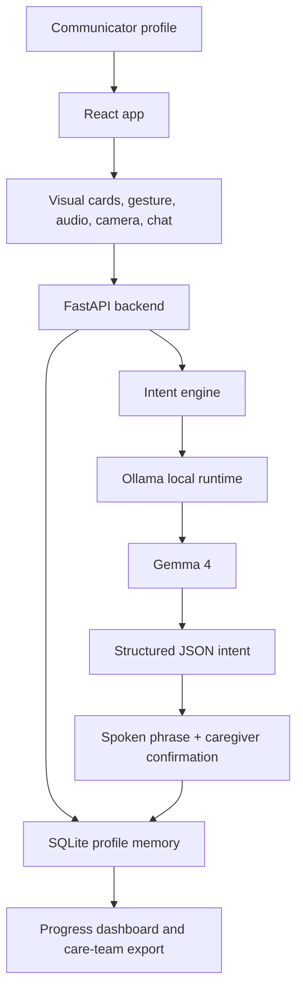

# SpeakUp

Privacy-first local AI communication support for autistic, nonspeaking, minimally speaking, AAC, aphasia, apraxia, and care-team communication needs.

SpeakUp helps a communicator share intent through visual cards, gesture signals, sounds, camera context, and chat. Gemma 4 runs through Ollama, combines the current signal with profile memory, returns a structured explanation, and speaks a first-person phrase aloud. Caregivers can confirm or correct results so each profile learns over time.

Built for the Kaggle Gemma 4 Good Hackathon.

## Why It Matters

Many families cannot access dedicated AAC devices that can cost thousands of dollars. Even when a device is available, it may not learn the communicator's personal signals: a soft vocalization, a repeated gesture, a routine, or a specific object association.

SpeakUp is designed as a local, free, privacy-first proof of concept:

- Local Gemma 4 inference through Ollama
- Separate profiles for each communicator
- Dedicated device mode for one selected profile
- Parent command center for alerts, reports, exports, and care-team details
- Memory-aware Gemma chat for communicators and caregivers
- Optional camera and audio inputs with caregiver control
- Synthetic demo data only

## Quick Start

Prerequisites:

- Python 3.10+
- Node.js 18+
- Ollama

```bash
git clone https://github.com/Hetul803/speakup
cd speakup
chmod +x scripts/*.sh
./scripts/setup.sh
ollama pull gemma4:e2b-it-q4_K_M
./scripts/start.sh
```

Open `http://localhost:5173`.

The backend auto-detects available Gemma 4 models and prefers the fine-tuned local model name `speakup-gemma4` when installed. It does not intentionally fall back to non-Gemma models.

## Architecture



## Gemma 4 Integration

SpeakUp sends Gemma 4 structured context:

```json
{
  "current_signals": {
    "gesture": "pointing",
    "sound": "soft mmm",
    "object": "cup",
    "time_of_day": "afternoon"
  },
  "profile_memory": {
    "soft mmm + cup": {
      "intent": "water",
      "confirmed": 4
    }
  }
}
```

Gemma 4 returns structured JSON:

```json
{
  "intent": "I want water",
  "confidence": 0.94,
  "spoken_phrase": "I want water, please.",
  "explanation": "The soft vocalization and cup match confirmed memory.",
  "alternatives": ["I am thirsty", "I want juice"],
  "needs_confirmation": false,
  "urgency": "normal",
  "emotion_detected": "neutral"
}
```

Camera frames are also handled through Gemma 4 multimodal reasoning. The backend first asks Gemma 4 to describe the scene and likely object, then includes that analysis in the final intent prompt.

## Fine-Tuning Proof

The repo includes the Colab notebook used for the T4 LoRA run:

- Notebook: `finetune/GEMMA4HACKATHON.ipynb`
- Proof summary: `finetune/FINE_TUNE_PROOF.md`
- Adapter proof files: `finetune/proof/`
- Base model: `unsloth/gemma-4-E2B-it-unsloth-bnb-4bit`
- Method: Unsloth QLoRA, rank 8, alpha 16
- Completed run: 3 epochs, 24 steps
- Final logged loss: 0.1734

The downloaded adapter zip is not committed because model artifacts should stay out of the public repo. For Kaggle, upload the LoRA zip as a Kaggle Dataset or attach it as a public artifact, then link it in the write-up.

## Repository Map

```text
speakup/
├── backend/                 FastAPI, SQLite, Gemma 4 integration
├── frontend/                React + Tailwind app
├── finetune/                Unsloth dataset, notebooks, LoRA proof
├── docs/                    Kaggle write-up, checklist, video assets
├── docs/submission_assets/  Thumbnail, icon, submission images
└── scripts/                 Setup, start, and demo recording helpers
```

## Ethical Positioning

SpeakUp is an assistive communication support tool. It is not a medical device, diagnostic tool, emergency service, or replacement for licensed clinicians, therapists, educators, or official care plans. Predictions should be reviewed by caregivers, and urgent or unclear situations should be handled by the responsible adult or care team.

## License

MIT
